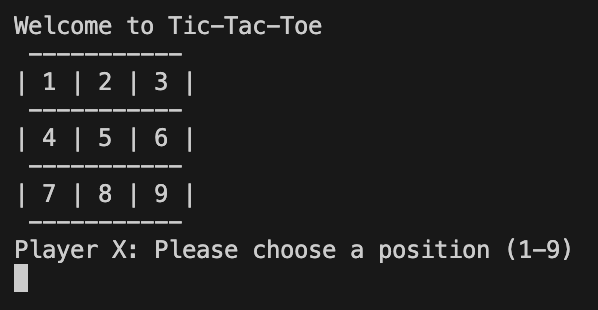

# Tic Tac Toe in Java
This is a simple two-player Tic Tac Toe game played in the terminal. Both players need to be physically present to take turns placing their marks on the board. Player X always starts the game.
When you run the program, the game board is displayed as shown below:

Player X makes the first move by selecting a position on the board. Then, Player O takes their turn, and the game continues with players alternating turns. Each new turn updates the board, like this:

The game ends when one player wins by placing three of their marks in a row (horizontally, vertically, or diagonally), or when the board is full without a winner (a draw). When a player wins, the final board is displayed with a congratulatory message, for example:

## How to compile and run the code
Open a terminal and navigate to the directory containing the Java files. Then run the following command to compile and start the game:
$ javac Main.java && java Main
The game will begin immediately, and you can start playing by following the on-screen prompts.
